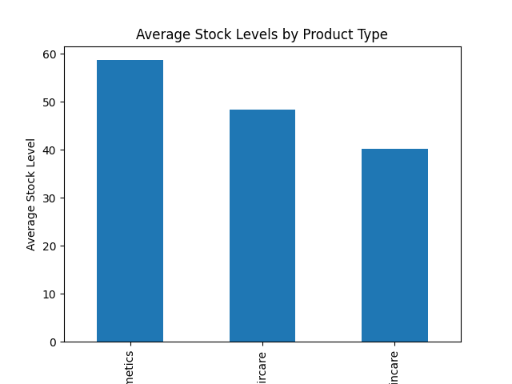

# Supply Chain Analysis Project

## Project Overview

This project analyzes supply chain data for a retail company to identify operational inefficiencies and opportunities for improvement in inventory management, supplier performance, product demand, and shipping efficiency.

The analysis was performed using Python with libraries such as Pandas, NumPy, and Matplotlib.

The goal of this project is to demonstrate how data analysis can help businesses make better supply chain decisions.

## Business Problem

Retail companies often face challenges such as:

* Overstocked inventory
* Slow product movement
* Supplier dependency risks
* Delayed shipping times
* Inefficient inventory allocation

This project analyzes supply chain data to uncover patterns in product demand, supplier performance, and logistics efficiency.

## Dataset Information

The dataset contains **100 records and 24 columns** describing various aspects of supply chain operations, including:

* Product type
* SKU
* Price
* Availability
* Number of products sold
* Revenue generated
* Stock levels
* Shipping times
* Supplier name
* Manufacturing costs
* Shipping carriers

## Tools & Technologies Used

* Python
* Pandas
* NumPy
* Matplotlib
* Jupyter Notebook
* VS Code

## Key Analysis Performed

The following analyses were performed:

1. Product demand analysis
2. Revenue analysis by product category
3. Supplier performance evaluation
4. Shipping time analysis
5. Inventory / stock level analysis

## Key Business Insights

1. **Skincare products generate the highest demand and revenue**, making them the most important product category.

2. **Cosmetics products show the lowest sales performance but maintain the highest stock levels**, indicating potential overstocking.

3. **Supplier 1 contributes the highest product sales**, while Supplier 4 contributes the least.

4. **Cosmetics products have the longest shipping times**, which may indicate possible logistics inefficiencies.

5. **Skincare products have the fastest shipping times while maintaining high demand**, suggesting efficient supply chain operations.

6. Inventory allocation may need adjustment to better align stock levels with product demand.

## Visualization Examples

Below are examples of insights generated from the analysis.

### Inventory Distribution by Product Type

## Project Structure

Supply_Chain_Analysis
│
├── data
│   └── supply_chain_data.csv
│
├── notebook
│   └── supply_chain_analysis.ipynb
│
├── visuals
│   └── stock_levels.png
│
├── dashboard
│
└── README.md

## Future Improvements

Possible future enhancements include:

* Building a Power BI dashboard for interactive analysis
* Performing demand forecasting
* Analyzing supplier lead times
* Identifying seasonal demand patterns

## Author

Vinay Hegde
